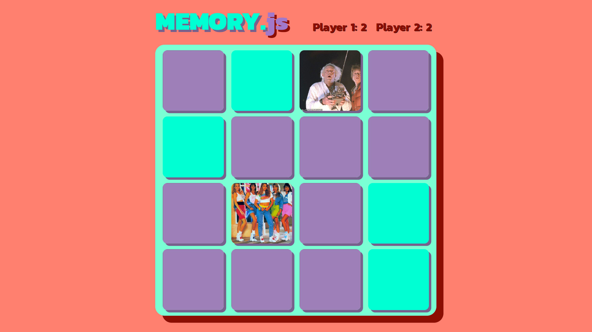

# JavaScript exercise 9 - Memory game
> My 9th project in JavaScript, but first after 1-year break from learning JS (a warm-up exercise).
80's themed memory game - [Click here to preview](https://karbudzik.github.io/JavaScript-exercise-9-memory-game/).
Script developed by me, with supervision from Codecool mentors.

## Screenshots

## Technologies
* HTML5
* plain CSS / no frameworks
* plain JavaScript / no frameworks